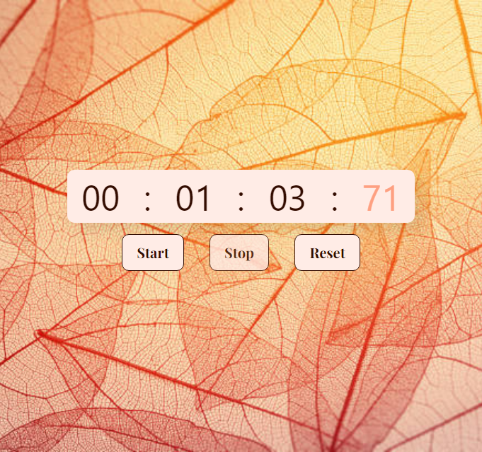

# JavaScript Timer

This is a simple JavaScript timer that allows you to track time in hours, minutes, seconds, and milliseconds. You can start the timer, stop it, and reset it to its initial state.

## Usage

To use the timer, follow these steps:

1. Open the HTML file in a web browser.
2. Click the "Start" button to start the timer.
3. Click the "Stop" button to pause the timer.
4. Click the "Reset" button to reset the timer to its initial state.

## Contributing

Contributions are welcome! If you find any issues or have suggestions for improvement, please open an issue or submit a pull request.

